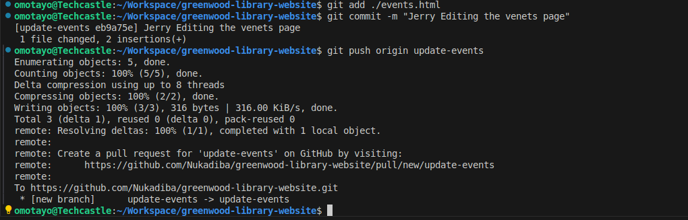

# greenwood-library-website

# 1.Setup

## GitHub Repository creation and cloning into local machine

# Files creation in the main repositoty 

# Commiting changes and pushin to the Main repository

# Creating Morgan Branch (add-book-review) and swicthing into it

# Creating book-reviews.html file under add-book-review branch

# Staging, commiting and pusing the changes to the Morgans's branch (add-book-review)

# Raising a PR for Mrogan's Work

# Merging Morgan's work into main Repository 

# Jerry's Work: Updating Events Pgae 

## Creating Jerry's Branch update-events

## jerry edidting events page and staging, commiting and pushing to update events branch

## Raising PR for Jerry's Work

# Merging jerry's work to the main repository 

# Merging history with resolution of conflicts 
